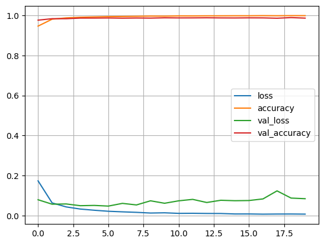
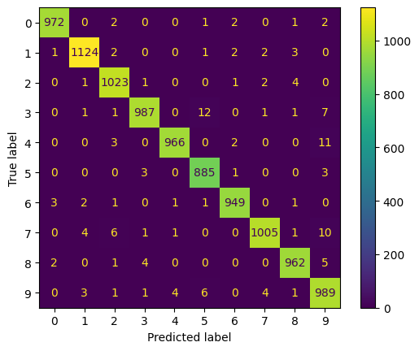

# Hand_Digit_Recognition_CNN
This repository contains a Convolutional Neural Network (CNN) approach for recognizing handwritten digits. By leveraging the MNIST dataset, I trained a deep learning model that can accurately classify images of digits (0-9).

## Overview

Handwritten digit recognition is a classic use case for CNNs, often showcased with the MNIST dataset. In this project:

1. A CNN model is constructed using Python and popular deep learning frameworks ( TensorFlow/Keras).
2. Hyperparameters such as learning rate(1-e3), batch size (32), and number of epochs(100) tuned to improve performance.
3. The network was evaluated on the MNIST test set, achieving accuracy 0.9856
```
model.compile(optimizer= tf.keras.optimizers.Adam(learning_rate=1e-3), loss = "sparse_categorical_crossentropy", metrics = ["accuracy"])

```

## Key Features
1. Data Preprocessing: Normalizes MNIST images and reshapes them for CNN input.
2. CNN Architecture: A multi-layer     convolutional network with:
- Convolutional layers
- Pooling layers
- Fully-connected layers (Dense layers)
- Activation functions (ReLU, Softmax)
3. Training & Evaluation: Configurable training loop with metrics logging and visualization of results.
```
output = tf.keras.layers.Dense(10, activation= "softmax", name = "output_layer")(x)

```

## Usage
-  Data Download
using Keras/TensorFlow, the MNIST dataset should download automatically
-  Training the Model
```
model_history = model.fit(x = x_train, y = y_train, validation_data=(x_val, y_val), batch_size= 32, epochs= 20)

```
- Evaluating the Model -
```
test_score = model.evaluate(x_test, y_test)

```

## Results
-  Accuracy: > 0.9862
-  Loss: ~ 0.0722  (varies by architecture/hyperparameters)


## License
This project is licensed under the MIT License. You are free to use, modify, and distribute this software in accordance with the terms of the license.